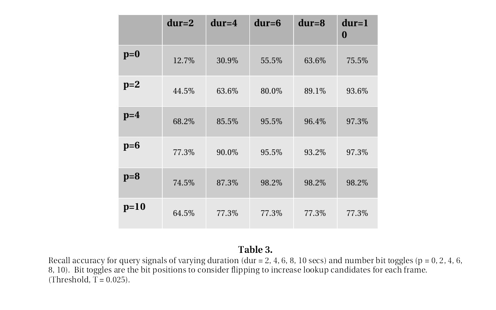

# JAudioScout 

AudioScout&trade; is an audio identification system that allows for
reasonable distortion in the audio signal.  The system consists
of a server which responds to commands from client
applications.

You can read more about it in this blog post: [here](http://blog.phash.org/posts/audioscout)

An API package for designing and building custom client applications
can be found here [JPHashAudio](https://github.com/starkdg/JPhashAudio)

You will also need [libAudioData](https://github.com/starkdg/libAudioData)
along with its java bindings for reading audio files.

This package consists of just the AudioScout server, auscoutd, and
a CLI client application for testing purposes - called AudioScout.


# Results

Recall reaches a 95% accuracy. This is based on 110 
queries against an index holding over 1200 audio tracks.
The query clips represent a fairly serious telephone distortion with an
added Gaussian noise.  The test was conducted various clip durations
and toggle settings.  A toggle settings is number of bits to consider
flipping when looking up candidate hash frames in the sequence.



# Build

To build the package,

```
mvn compile test package
```

This should put the executables in the target bin directory.


# API

The server API is provided by the Auscoutd server. It provides
the means for client applications to query and submit and otherwise
interact with the audio data.  

server modes:
1. query - simple query by an audio signal.  Server returns 0 or more
           possible matches.
2. submit - submit new files to be indexed.  Server returns integer id.
            (The integer id is need for later deletion).
3. query  - complex query by audio samples. Returns 0 or more possible
            matches, each with a ranking confidence score and integer
            position denoting its relative position in which it was matched
            to the candidate position.
4. sync - sync command to synchronize new entries into the data store.
5. threshold - change the global threshold for queries.
6. delete - command to delete designated id values from system.
            Note: Use sparingly.  Entries are not immediately deleted but
            are saved to a file for periodic sweeps of all entries.  The
            time of day when this is performed is configurable.
7. query - query with threshold. Same as mode 3 but with adjustable threshold. 
           The other queries are use the global threshold at which the
           server is set.  


The Auscoutd program can be accessed by the corresponding program scripts in the bin 
folder.  Simply invoke with no arguments to get the usage information:

./Auscoutd

A log4j configuration file can be found at /etc/auscoutd.properties file.  On execution,
auscoutd.log file will be produced in the bin directory.

Two options must be provided: -homedir and -mdata, which are the locations of directories
for file storage for the data stores.  Be sure you have plentiful space in these directories.


# Client API

There is an example client program, AudioScout, which can be accessed by the corresponding script
in the bin directory.  Simply invoke with no arguments for usage information:

./AudioScout

The 'print' option allows for printing out the audio hash values for each audio file in a directory.  

# Utility

MDataScroll is a utility to scroll through the indexed entries in the meta data index.

